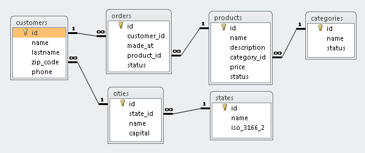

# example_msaccess_python

Examples for create a [Microsoft Access](https://en.wikipedia.org/wiki/Microsoft_Access) database and query his data with Python.

## Libraries

There are the following libraries supported:

- [pyODBC](pyodbc/) Examples.

- [SQLAlchemy](sqlalchemy/) Examples.

## Entity–relationship model

## Documentation

Download the database documentation [here](./doc/doc_rptObjects.pdf).

## Requirements previous

- Install the [Microsoft Access Database Engine 2010 Redistributable (Drivers)](https://www.microsoft.com/en-us/download/details.aspx?id=13255) or Microsoft Access Professional 2010.

## Tested it with

- Microsoft Access Professional 2010.
